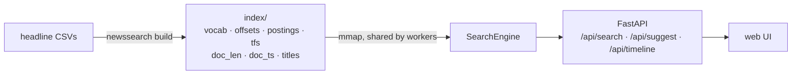

# Oil News Search

Full-text search over GDELT oil-market headlines, with the search engine written from
scratch: an inverted index in compressed-sparse-row form, BM25 ranking, time-ordered doc
ids for O(log n) date filtering, and prefix autocomplete over a sorted vocabulary. Served by
FastAPI with an accessible web UI, packaged for Cloud Run.

## Performance

Corpus: **209,936** unique oil-market headlines (210,848 raw GDELT records, 2026-02-15 → 2026-04-26),
46,621 terms, 2.1M postings. Index builds in **4.3 s** and loads in **11 ms** (mmap).
Measured on an Apple M3 Pro laptop with the result cache **disabled**, using query logs sampled
from the corpus (1–3 keywords per query). Load generator and server share the same machine.

| Benchmark | Throughput | p50 | p95 | p99 | Errors |
|---|---:|---:|---:|---:|---:|
| Engine only, 1 thread (5,000 queries) | 2,589 QPS | 0.15 ms | 1.7 ms | 2.5 ms | – |
| HTTP, 4 workers, 8 concurrent users (30 s) | 4,417 search QPS | 1 ms | 4 ms | 5 ms | 0 / 164,553 |
| HTTP, 4 workers, 64 concurrent users (60 s) | 3,715 search QPS | 14 ms | 26 ms | 32 ms | 0 / 277,702 |

At 64 users the laptop is CPU-saturated (Locust competes with the server), so latency is
queueing time, not search time. Reproduce with the commands under [Run it](#run-it).

## How it works



**Index build** ([`index.py`](src/newssearch/index.py))
- Syndicated copies (same normalized title) collapse to the earliest one.
- Documents are numbered in publish-time order, so any date range is a contiguous id range.
- Postings are grouped per term with a single `lexsort`, stored as CSR arrays
  (`offsets[t]..offsets[t+1]` → sorted doc ids + term frequencies).
- Terms are renumbered alphabetically so prefix lookup is a binary search.
- Everything is written as flat `.npy`/binary files and loaded with `mmap`: startup is
  near-instant and every Uvicorn worker shares one copy of the index in the OS page cache.

**Query** ([`search.py`](src/newssearch/search.py))
1. Tokenize exactly like indexing (lower-case, stopwords, light plural folding).
2. Date filter: two `searchsorted` calls on `doc_ts` give `[lo, hi)`; each term's postings
   are then sliced with two more binary searches instead of being scanned.
3. BM25 (k1 = 1.2, b = 0.75) is computed vectorized per term; the query-independent length
   norm is precomputed once per document.
4. Multi-term merge: concatenate, stable-sort by doc id, `add.reduceat` to sum partial scores.
5. Top-k with `argpartition` (O(n)) and a final sort of only k items; ties go to newer headlines.
6. An LRU cache holds finished result pages (never the full match arrays, which can span most
   of the corpus for a term like "oil").

**Correctness**: a Hypothesis property test generates random corpora and queries and checks
every score and the ranking against a naive, loop-based BM25 reference implementation.

## API

| Endpoint | Parameters | Returns |
|---|---|---|
| `GET /api/search` | `q`, `k` ≤ 50, `offset`, `start`, `end` (dates, end exclusive) | ranked hits, total matches, `took_ms` |
| `GET /api/suggest` | `prefix`, `limit` | most frequent terms with that prefix |
| `GET /api/timeline` | `q`, `start`, `end` | matches per month |
| `GET /api/stats` | | corpus size, vocabulary, cache hit rate |
| `GET /healthz` | | liveness |

Interactive docs at `/docs`.

## Accessibility

The UI follows the WAI-ARIA combobox pattern for autocomplete (`aria-expanded`,
`aria-activedescendant`, arrow keys / Enter / Escape), announces result counts through an
`aria-live` status region, gives the timeline chart a text alternative, includes a skip link
and visible focus rings, and respects `prefers-color-scheme`. Headlines are rendered with DOM
text nodes, never `innerHTML`.

## Run it

```bash
python -m venv .venv && source .venv/bin/activate
pip install -e ".[dev,bench]"
pytest                                            # unit, API, and property tests

newssearch build --out index data/*.csv           # CSV/TSV with news_time|published_utc + title
INDEX_DIR=index uvicorn newssearch.api:app --workers 4 --port 8080
```

Benchmarks:

```bash
python bench/bench_engine.py --index index                      # in-process latency, cache off
CACHE_SIZE=0 INDEX_DIR=index uvicorn newssearch.api:app --workers 4 --port 8080 &
INDEX_DIR=index locust -f bench/locustfile.py --headless -u 64 -r 16 -t 60s \
    --host http://127.0.0.1:8080 --csv bench/results/load
```

Container / Cloud Run:

```bash
docker build -t oil-news-search .
docker run -p 8080:8080 oil-news-search
gcloud run deploy oil-news-search --source . --memory 2Gi --allow-unauthenticated
```

## Data

Headlines come from the GDELT Global Knowledge Graph 2.1 (public on BigQuery as
`gdelt-bq.gdeltv2.gkg_partitioned`), filtered to oil-market coverage with the query in
[oil-news-wti-signals](https://github.com/yangzai320/oil-news-wti-signals/blob/main/sql/extract_oil_news.sql).
Raw data and the built index are not committed.
